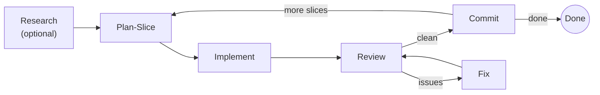
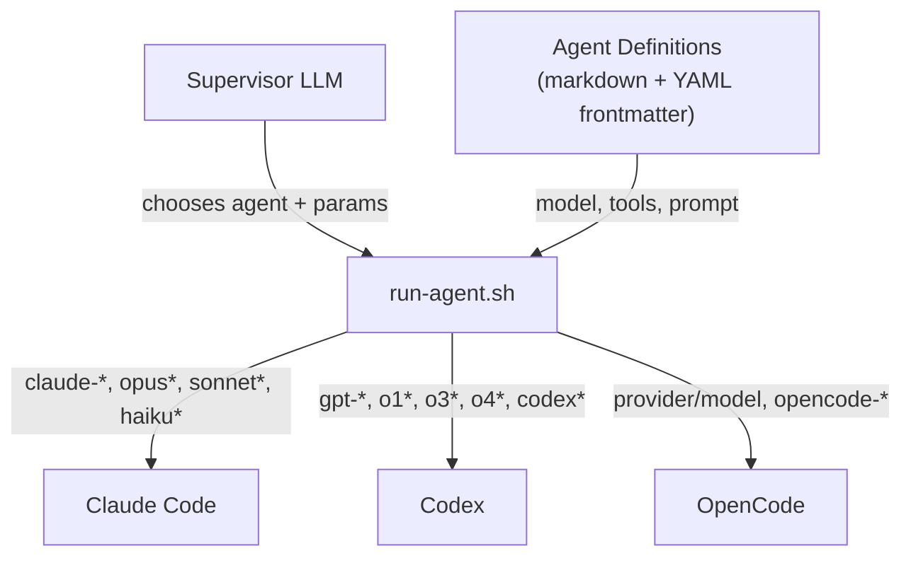

# Orchestrate

Stop satisficing with one CLI. Use Claude Code, Codex, and OpenCode together — each doing what it's best at.

Orchestrate is a multi-agent supervisor that routes specialized agents across CLI harnesses. Codex writes the code, Opus reviews it, Haiku commits it. You write a plan, it handles the rest.

It is built from:
- `skills/orchestrate/` — supervisor loop logic
- `skills/run-agent/` — execution engine (`run-agent.sh`) + agent definitions
- Native CLI install mechanisms (plugin/skills installers per harness)

## Why

### `run-agent.sh` — one wrapper, every CLI

Agents are just markdown files with a model name in YAML frontmatter. `run-agent.sh` inspects the model string and routes to the right CLI — Claude Code, Codex, or OpenCode — normalizing prompt composition, tool allowlists, and execution along the way.

Each CLI has strengths: Codex for exhaustive code generation, Claude Opus for thoughtful review, Sonnet for fast iteration. You shouldn't have to care about the plumbing differences between them — different tool-control surfaces, different effort flags, different JSON output formats. `run-agent.sh` handles all of it so agents are portable across harnesses.

### LLM-controlled agent loops

Most multi-agent setups are fixed pipelines: step A, then B, then C. Orchestrate is closer to [aider's architect mode](https://aider.chat/docs/usage/modes.html) or [Ralph](https://github.com/snarktank/ralph)-style bash loops, but the supervisor is an LLM, not a script.

The supervisor reads your plan, decides what agent to run next, reads the report back, and adapts — choosing which agent variant to use, whether to re-review, when to escalate from `implement` to `implement-deliberate`. It can skip research if the plan is clear, run parallel reviewers for risky slices, or switch implementation strategy mid-plan.

The structured loop (plan-slice, implement, review, fix/commit, repeat) gives it a framework, but the LLM makes the judgment calls within it. Unlike fixed pipelines or single architect/editor pairs, the supervisor can switch agent variants per slice, skip steps, retry, or escalate — adapting the workflow as it goes.

## Install

### Quick start

Paste this into any LLM-powered coding CLI (Claude Code, Codex, OpenCode):

```
Fetch and follow instructions from https://raw.githubusercontent.com/haowjy/orchestrate/main/INSTALL.md
```

### Manual install

**1. Add orchestrate**

As a submodule:
```bash
git submodule add https://github.com/haowjy/orchestrate .agents/.orchestrate
```

Or as a clone:
```bash
mkdir -p .agents
git clone https://github.com/haowjy/orchestrate .agents/.orchestrate
echo '.agents/.orchestrate/' >> .gitignore   # keep the clone out of parent repo
```

**2. Run install**

```bash
bash .agents/.orchestrate/install.sh
```

Or manually copy skills:
```bash
mkdir -p .agents/skills .claude/skills
for skill in .agents/.orchestrate/skills/*/; do
  cp -r "$skill" ".agents/skills/$(basename "$skill")"
  cp -r "$skill" ".claude/skills/$(basename "$skill")"
done
```

**3. Verify**

```bash
ls -la .agents/skills/
ls -la .claude/skills/
```

Result:
```
.agents/
├── .orchestrate/         # submodule or clone (hidden)
└── skills/
    ├── orchestrate/      # copied from .orchestrate/skills/orchestrate
    ├── run-agent/        # copied from .orchestrate/skills/run-agent
    ├── review/
    ├── research/
    └── ...

.claude/skills/
├── orchestrate/
├── run-agent/
├── review/
└── ...
```

### Native harness installers

**Claude Code** (plugin marketplace — recommend project scope):
```bash
/plugin marketplace add haowjy/orchestrate
/plugin install orchestrate@haowjy-orchestrate --scope project
```
`--scope project` installs into `.claude/settings.json` so all collaborators get the plugin automatically. Use `--scope local` for personal-only.

**Codex** (built-in skill installer):
```
$skill-installer install https://github.com/haowjy/orchestrate
```
Installs to `~/.codex/skills/orchestrate`. Requires `codex --enable skills` feature flag.

**OpenCode** — no native skill installer. Use the per-repo approach above.

### Updating

If installed as submodule:
```bash
git submodule update --remote .agents/.orchestrate
```

If installed as clone:
```bash
cd .agents/.orchestrate && git pull && cd -
```

Re-run `install.sh` after updating to refresh skill copies. Re-running preserves any custom agents or files you added.

### Customizing agents per-repo

Add new agent definitions alongside the shipped ones:

```bash
# Add a project-specific agent
vi .agents/skills/run-agent/agents/implement-backend.md
vi .agents/skills/run-agent/agents/review-security.md
```

Re-running `install.sh` after an update will overwrite shipped files but never delete your additions. If you need to customize a shipped agent, create a new one instead of editing it — edits to shipped files will be lost on re-install.

## Getting Started

1. Write a plan file (e.g., `_docs/my-plan.md`) describing what to build
2. Run `/orchestrate:orchestrate _docs/my-plan.md`
3. The orchestrator runs autonomously until complete

## How It Works



You write a plan (markdown). The orchestrator reads it and autonomously loops through:

1. **Research** (optional) — explores the codebase and web to inform planning
2. **Plan-slice** — determines the next self-contained unit of work
3. **Implement** — writes the code
4. **Review** — checks for issues
5. **Cleanup** — fixes any violations found
6. **Commit** — stages and commits with a clean message
7. **Repeat** until the plan is done

## Cross-Harness Architecture



The skill structure works natively across all three CLIs:

| CLI | Discovery | Install |
|-----|-----------|---------|
| **Claude Code** | `.claude-plugin/plugin.json` → `skills/` | Marketplace or `--plugin-dir` |
| **Codex** | `.agents/skills/*/SKILL.md` (walks to git root) | Native Codex skills installer |
| **OpenCode** | `.agents/skills/` + `.claude/skills/` (walks up) | Native OpenCode skills installer |

Model routing is automatic — agent definitions specify a model name, and `run-agent.sh` routes to the correct CLI:

| Model Pattern | CLI | Examples |
|---------------|-----|----------|
| `claude-*`, `opus*`, `sonnet*`, `haiku*` | `claude` | `claude-sonnet-4-6`, `opus` |
| `gpt-*`, `o1*`, `o3*`, `o4*`, `codex*` | `codex` | `gpt-5.3-codex`, `o4-mini` |
| `opencode-*`, `provider/model` | `opencode` | `opencode/kimi-k2.5-free`, `anthropic/claude-sonnet-4-6` |

Override routing with `ORCHESTRATE_DEFAULT_CLI=opencode` to force all agents through a specific CLI.

## Repository Structure

```
orchestrate/
├── .claude-plugin/          # Plugin manifest
│   ├── plugin.json
│   └── marketplace.json
├── skills/
│   ├── orchestrate/         # Supervisor brain (loop logic only)
│   │   ├── SKILL.md
│   │   └── README.md
│   ├── run-agent/           # Execution engine
│   │   ├── SKILL.md
│   │   ├── README.md
│   │   ├── agents/          # All agent definitions
│   │   └── scripts/         # run-agent.sh, lib/, utilities
│   ├── research/            # Research methodology skill
│   │   └── SKILL.md
│   ├── plan-slice/          # Slice planning skill
│   │   └── SKILL.md
│   ├── review/              # Code review skill + rules
│   │   ├── SKILL.md
│   │   └── references/
│   ├── model-guidance/      # Model selection guidance
│   │   └── SKILL.md
│   ├── smoke-test/          # Smoke test conventions
│   │   └── SKILL.md
│   └── scratchpad/          # Scratch notes conventions
│       └── SKILL.md
├── README.md
└── LICENSE
```

## Agent Types

### Research

| Agent | Model | Focus |
|---|---|---|
| `research-claude` | claude-sonnet-4-6 | Web + codebase exploration |
| `research-codex` | gpt-5.3-codex | Deep codebase analysis + web search |
| `research-kimi` | opencode/kimi-k2.5-free | Alternative perspective via Kimi |

### Implementation

| Agent | Model | Best For |
|---|---|---|
| `implement` | gpt-5.3-codex | Default — most slices |
| `implement-iterative` | claude-sonnet-4-6 | Fast UI iteration loops |
| `implement-deliberate` | claude-opus-4-6 | Complex logic, subtle bugs |

### Review

| Agent | Model | Effort | Personality |
|---|---|---|---|
| `review` | claude-opus-4-6 | high | Thoughtful senior dev — SOLID, consistency, clean code |
| `review-thorough` | gpt-5.3-codex | high | Exhaustive auditor — SOLID, consistency, clean code deep-dive |
| `review-quick` | gpt-5.3-codex | low | Fast sanity check — obvious bugs and blockers only |
| `review-adversarial` | claude-sonnet-4-6 | high | Adversarial tester — writes scratch tests to break the code |

All review agents support **dual mode**: given a plan, they review the plan; given implemented code, they review the code.

### Utility

| Agent | Model | Purpose |
|---|---|---|
| `plan-slice` | gpt-5.3-codex | Creates next implementable slice from a plan |
| `cleanup` | gpt-5.3-codex | Targeted fix from review findings |
| `commit` | claude-haiku-4-5 | Clean commit message from working tree |

## Running Agents Directly

```bash
# From this repo root:
AGENT_RUNNER=skills/run-agent/scripts/run-agent.sh

# If installed into a project:
# AGENT_RUNNER=.agents/skills/run-agent/scripts/run-agent.sh

# Run an agent by name
"$AGENT_RUNNER" review -v SLICES_DIR=.runs/plans/my-plan/slices/01-foo

# Override model on any agent
"$AGENT_RUNNER" implement -m claude-opus-4-6

# Ad-hoc (no agent definition)
"$AGENT_RUNNER" --model claude-sonnet-4-6 --skills review -p "Review the changes"

# Dry run — see composed prompt + CLI command without executing
"$AGENT_RUNNER" review --dry-run -v SLICES_DIR=/tmp/test

# Use a provider/model format (auto-routes to opencode)
"$AGENT_RUNNER" --model anthropic/claude-sonnet-4-6 -p "Review the changes" --dry-run

# Force all agents through opencode
ORCHESTRATE_DEFAULT_CLI=opencode "$AGENT_RUNNER" implement --dry-run

# 3-way parallel research
ORCHESTRATE_LOG_DIR=.runs/project/logs/agent-runs/research-claude \
  "$AGENT_RUNNER" research-claude -v PLAN_FILE=my-plan.md &
ORCHESTRATE_LOG_DIR=.runs/project/logs/agent-runs/research-codex \
  "$AGENT_RUNNER" research-codex -v PLAN_FILE=my-plan.md &
ORCHESTRATE_LOG_DIR=.runs/project/logs/agent-runs/research-kimi \
  "$AGENT_RUNNER" research-kimi -v PLAN_FILE=my-plan.md &
wait
```

## Configuration

### Environment Variables

| Variable | Description | Default |
|---|---|---|
| `ORCHESTRATE_RUNS_DIR` | Runtime data (plans, logs, scratch) | `.runs/` under the active working directory |
| `ORCHESTRATE_LOG_DIR` | Override log directory for a single run | Auto-derived from scope |
| `ORCHESTRATE_DEFAULT_CLI` | Force all model routing to a specific CLI (`claude`, `codex`, `opencode`) | Auto-detect from model name |
| `ORCHESTRATE_AGENT_DIR` | Override agent definition directory | unset |

### Model Overrides

Every agent has a default model in its frontmatter. Override per-run:

```bash
AGENT_RUNNER=skills/run-agent/scripts/run-agent.sh

# Use a specific model for one run
"$AGENT_RUNNER" implement -m claude-opus-4-6

# Use provider/model format (routes to opencode automatically)
"$AGENT_RUNNER" implement -m anthropic/claude-sonnet-4-6

# Force all agents through claude CLI (even if model name suggests codex)
ORCHESTRATE_DEFAULT_CLI=claude "$AGENT_RUNNER" implement
```

### Custom Agents

Create `skills/run-agent/agents/my-agent.md` (or `.agents/skills/run-agent/agents/my-agent.md` in your project) with YAML frontmatter:

```yaml
---
name: my-agent
description: What this agent does
model: claude-sonnet-4-6
effort: high
tools: Read,Edit,Write,Bash,Glob,Grep
skills:
  - review
---

Your prompt here. Use {{TEMPLATE_VARS}} for dynamic values.
```

Agent definitions are intentionally user-editable after install. Common patterns:
- Modify built-in agents in your project (for example `.agents/skills/run-agent/agents/implement.md`) to encode codebase-specific rules.
- Add new project-specific agents (for example `implement-backend.md`, `review-security.md`) and run them directly with `run-agent.sh`.
- Keep team conventions in project `AGENTS.md`/`CLAUDE.md`; the agent prompts already instruct subagents to read those files.

Agent lookup precedence for `run-agent.sh <agent-name>`:
1. `ORCHESTRATE_AGENT_DIR/<agent>.md` (if set)
2. `<workdir>/.agents/skills/run-agent/agents/<agent>.md`
3. `<workdir>/.claude/skills/run-agent/agents/<agent>.md`
4. bundled `skills/run-agent/agents/<agent>.md`

### Custom Review Rules

Add rules to `skills/review/references/` (or `.agents/skills/review/references/` in your project):
- `general.md` — always loaded (ships with the plugin)
- `<directory>.md` — loaded when reviewing files under that top-level directory

The review skill also reads `CLAUDE.md`/`AGENTS.md` from the project root for project-specific conventions.

## Execution Mode and Safety

`run-agent.sh` launches each harness in autonomous mode:
- Claude CLI uses `--dangerously-skip-permissions`
- Codex CLI uses `--full-auto`

Tool allowlists are currently applied only for Claude (`--allowedTools`). Codex and OpenCode do not expose equivalent allowlist flags in `exec/run`.

`run-agent.sh` auto-creates `ORCHESTRATE_RUNS_DIR/.gitignore` with:
`*` and `!.gitignore`
so runtime artifacts stay untracked without requiring parent `.gitignore` edits.

Use this only in trusted repos/worktrees. Prefer reviewing `--dry-run` output when testing new agent prompts.

## CLI Requirements

- **Required**: At least one of `claude`, `codex`, or `opencode` CLI
- **Optional**: `claude` CLI (Claude Code) — for `claude-*` model agents
- **Optional**: `codex` CLI — for `gpt-*`/`codex-*` model agents
- **Optional**: `opencode` CLI — for `provider/model` format or `opencode-*` model agents

## License

MIT
