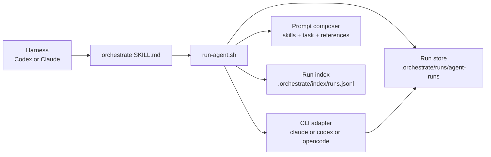
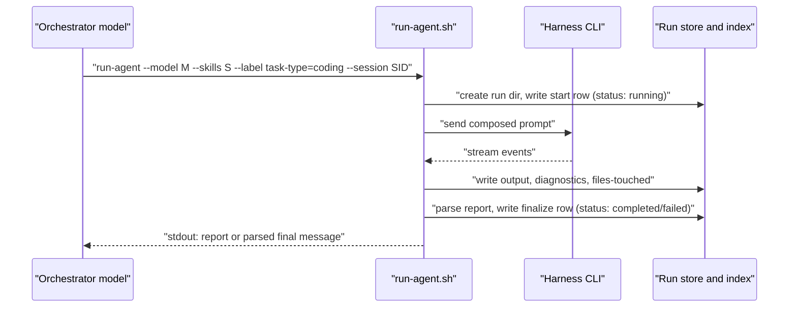

# Orchestrate Simplification Design

Status: Draft v4
Date: 2026-02-23
Scope: `orchestrate/` submodule only

## Problem

`run-agent` and `orchestrate` currently mix too many concerns:

- harness routing
- skill composition
- runtime path inference
- workflow-specific context assumptions (plans, slices, handoffs)
- logging and observability
- optional helper workflows (commit recording)

That complexity is causing fragile behavior, especially around path resolution and script invocation across harnesses.

Additionally, project-specific workflow concepts (plans, slices, handoffs) have leaked into what should be a generic orchestration toolkit, limiting portability.

## Product Intent

- `orchestrate/` is the source-of-truth skill repo — a **general-purpose multi-model supervisor toolkit**.
- `install.sh` copies skills from an explicit manifest (`MANIFEST`) into `.agents/skills` and `.claude/skills`.
- Harnesses discover and invoke skills from those folders.
- `run-agent` is the orchestration runtime core.
- Other skills are default coding-assist skills that can be composed with `run-agent`, not orchestration internals.
- **No project-specific workflow concepts** (plans, slices, handoffs) in the orchestration core. Those belong in project-level skills.

## Design Goals

1. Make path resolution deterministic and harness-agnostic.
2. Keep observability first-class with simpler run storage.
3. Reduce script surface area to the minimum set.
4. Keep skill composition flexible, but avoid hidden hierarchy behavior.
5. Preserve user override freedom in `.agents` and `.claude` copies.
6. **Separate orchestration infrastructure from project workflow conventions.**

## Non-Goals

1. No model-policy lock-in for users.
2. No hard enforcement of a single skill set.
3. No dependence on environment variables for runtime behavior.
4. No backward compatibility with existing run data (clean break).
5. No project-specific concepts (plans, slices) in the runtime.

## External Constraints from Skill Specs

### Claude Code skills

- Skills are directories with `SKILL.md` plus optional `scripts/`, `references/`, and `assets/`.
- Skill instructions should reference script paths explicitly from project root to avoid ambiguity.

### Codex skills

- Skills use progressive disclosure; metadata is loaded first, `SKILL.md` only when selected.
- Skill locations are discovered from `.agents/skills` across cwd-to-repo-root and user/admin/system scopes.
- If duplicate skill names exist, they are not merged.

### Open Agent Skills standard

- `SKILL.md` is required.
- `scripts/`, `references/`, and `assets/` are optional.

## Simplification Principles

1. One core runtime script (`run-agent.sh`) owns execution.
2. One run identifier format is used everywhere.
3. One append-only run index powers observability and lookup.
4. Default resources are resolved through loader scripts with deterministic precedence.
5. No script behavior controlled by env vars.
6. **Orchestrate owns runs, labels, and sessions. Projects own workflow semantics.**
7. **No "agent" abstraction.** A run is `model + skills + prompt`. Named agents are just convenience aliases with no runtime meaning.

## Skill Writing Best Practices

Use these rules for all shipped skills in this submodule.

1. Keep `SKILL.md` trigger guidance explicit.
- Include clear "use when / do not use when" intent in `description` and body.

2. Use progressive disclosure aggressively.
- Keep `SKILL.md` concise.
- Put large reference content in `references/*.md`.
- Put operational logic in `scripts/`.

3. Never encode precedence logic only in prose.
- Enforce precedence with scripts (for example, loader scripts) so behavior is deterministic.
- Defaults must be ignored automatically when custom override files exist.

4. Keep script paths skill-local and portable.
- Prefer `scripts/...` and `../<skill>/...` paths that work in both `.agents/skills` and `.claude/skills`.

5. Avoid environment-variable contracts for core behavior.
- Core runtime behavior should come from explicit flags and files.

6. Design scripts for LLM consumption.
- Stable output schema, low-token defaults, explicit pagination for list/log views, machine-parseable modes.

7. Keep compatibility wrappers thin.
- Wrapper skills may remain user-invocable, but source-of-truth resources should live in one place.

## Options Evaluated for Run Storage

Local benchmark (3,840 synthetic runs) measured directory creation and lookup patterns.

| Option | Layout | Create Time | Label Query | Latest Query | Notes |
|---|---|---:|---:|---:|---|
| A | hierarchical (`runs/{scope}/.../agent-runs/...`) | 4540 ms | 3 ms | 63 ms | Great scoped lookup, slower global latest |
| B | flat long-name (`runs/agent-runs/{scope}__...`) | 4594 ms | 17 ms | 14 ms | Easier global lookup, weaker scoped ergonomics |
| C | date-sharded (`runs/by-day/...`) | 4626 ms | 49 ms | 49 ms | No clear win for orchestrate use-case |
| D | flat + index (`runs/agent-runs/...` + `index/runs.jsonl`) | 4750 ms | 10 ms | 4 ms | Best observability with simple retrieval |

## Decision

Adopt **flat run directories + append-only index**:

- Run dirs: `.orchestrate/runs/agent-runs/<run-id>/`
- Index: `.orchestrate/index/runs.jsonl`
- Exactly one canonical index file at runtime (no sharding by default)

This removes deep path inference while keeping fast filtering via indexed labels.

For index growth, add a required maintenance command:

- `run-index.sh maintain --compact --before-days <n>` (default `n=90`)
- Move finalized runs older than `<n>` days to `.orchestrate/index/archive/runs-YYYYMMDD.jsonl`
- Keep active `.orchestrate/index/runs.jsonl` as canonical source for current runs and all non-finalized rows
- `list` and `stats` default to active index only, with `--include-archive` for historical queries

## Proposed Architecture



### Execution Contract

`run-agent.sh` should:

1. Resolve repo root from current working directory.
2. Build prompt from explicit inputs (`--model`, `--skills`, `-p`, `-f`, `--label`, `--session`). When composing skill content into the prompt, include the resolved filesystem path each skill was loaded from (e.g., `Loaded from: .agents/skills/review/SKILL.md`) so the subagent can resolve relative references to that skill's `scripts/`, `references/`, and `assets/` directories.
3. Write a start index row (`status: "running"`) immediately for crash visibility.
4. Stream harness output to run files.
5. Parse final assistant message from harness output as report fallback.
6. Print only final report (or parsed final message fallback) to stdout.
7. Write a finalize index row (`status: "completed"` or `"failed"`) with exit code, duration, and metrics.
8. Use index locking for both append and read operations: shared/read lock for list/query and exclusive lock for append. If `flock` is unavailable, use a lockdir fallback (`mkdir`-based lock with timeout).

### Run ID and Files

Run ID format:

`<utc-ts>__<model>__<task-type>__<pid>`

All run ID components must be sanitized for filesystem and parsing safety:

- **Timestamp**: ISO 8601 compact UTC format (`YYYYMMDDTHHMMSSZ`), no special characters.
- **Model**: replace `/` with `-` (e.g., `anthropic/claude-sonnet-4-6` → `anthropic-claude-sonnet-4-6`). Original model name preserved in `params.json`.
- **Task-type**: restricted to `[a-z0-9-]` (lowercase alphanumeric + hyphens). Values not matching are normalized (lowercase, replace non-matching chars with `-`, collapse consecutive hyphens). Default: `coding`.
- **PID**: numeric, no sanitization needed.
- **Separator**: `__` (double underscore) is reserved as the component delimiter and must not appear within any component.

Per-run files:

- `params.json`
- `input.md`
- `output.jsonl` (normalized file extension)
- `stderr.log`
- `report.md`
- `files-touched.nul` (NUL-delimited via `print0`-style output, canonical machine-readable format; handles filenames with newlines/special chars)
- `files-touched.txt` (derived from `.nul` via `tr '\0' '\n'`, one-per-line for human display)

### Index Row Schema

Two rows per run: **start** (written before execution) and **finalize** (written after).

Start row fields:

- `run_id`
- `status` (`running`)
- `created_at_utc`
- `cwd`
- `session_id`
- `model`
- `harness`
- `skills`
- `labels.task-type` (primary label, required; example: `coding`)
- `labels.*` (user-defined labels)
- `log_dir`

Finalize row fields:

- `run_id`
- `status` (`completed` | `failed`)
- `finished_at_utc`
- `duration_seconds`
- `exit_code`
- `failure_reason` (normalized classification when `status=failed`; derived from exit code: `agent_error` for exit 1, `infra_error` for exit 2, `timeout` for exit 3, `interrupted` for SIGINT/SIGTERM, `unknown` otherwise; `null` when `status=completed`)
- `output_log`
- `report_path`
- `harness_session_id` (extracted from output; enables future `--continue-run`)
- `continues` (run ID of original run, if this was a continuation)
- `continuation_mode` (`fork` | `in-place` | `fallback-prompt`, if continuation)
- `continuation_fallback_reason` (`missing_session_id` | `unsupported_harness` | `parse_failure`, `null` otherwise)
- `retries` (run ID of the original run, if this is a retry via `retry <run-ref>`)
- `git_available`
- `in_git_repo`
- `head_before`
- `head_after`
- `commit_count`
- `commit_tracking`
- `commit_tracking_source` (`log` | `fallback_git` | `none`)
- `commit_tracking_confidence` (`high` | `medium` | `low`)
- `commits` (commit count by default; full hashes in `params.json`)
- `input_tokens` (optional, parsed from harness output)
- `output_tokens` (optional, parsed from harness output)

A start row with no matching finalize row means the run crashed or is still in progress.

### Derived Run View Contract

`runs.jsonl` is a raw event log. Explorer commands must operate on a deterministic derived view:

1. Group rows by `run_id`.
2. Require exactly one start row per run.
3. Treat finalize row as optional.
4. Derive `effective_status`:
   - `completed` or `failed` when finalize row exists
   - `running` when finalize row is missing
5. Derive `started_at` from `created_at_utc`.
6. Derive `finished_at` from `finished_at_utc` (or `null` when missing).
7. `list` and `show` return one derived item per `run_id` (never raw start/final rows).
8. Default sort order is `started_at desc`.

### Structured Exit Codes

| Code | Meaning |
|------|---------|
| 0 | Success |
| 1 | Agent/model error (bad output, task failure) |
| 2 | Infrastructure error (CLI not found, harness crash) |
| 3 | Timeout |
| 130 | Interrupted (SIGINT / user cancel) |
| 143 | Terminated (SIGTERM) |

`run-agent.sh` installs a trap for SIGINT/SIGTERM that writes the finalize row with `status=failed` and the appropriate exit code before exiting. This ensures interrupted runs are observable in the index rather than appearing as crashes (missing finalize row).

These help the orchestrator make smarter decisions (retry vs escalate vs abort) without parsing logs.

### Label Contract

The runtime, not the model, owns label serialization into the index.

- Primary label: `task-type` (required)
- Example values: `coding`, `research`, `review`, `ops`, `docs`
- Optional labels: free-form key/value pairs for workflow-specific grouping

Recommended `run-agent` behavior:

1. Accept `--label KEY=VALUE` (repeatable).
2. Derive default `task-type=coding` when omitted.
3. Reject empty label keys/values.
4. Write normalized labels into `runs.jsonl`.

Project-specific grouping (e.g., `--label plan=auth-refactor --label ticket=PAY-123`) is done through labels, not first-class flags.

### Session Contract

`session_id` is an orchestrate-level concept: a logical grouping of related runs within one orchestration pass.

Recommended behavior:

1. Add explicit `--session <id>` flag.
2. If omitted, default `session_id` to `run_id` (each run is its own session).
3. Persist `session_id` in both `params.json` and `runs.jsonl`.
4. The orchestrator generates a session ID when it starts and passes it to each `run-agent` call.

This is distinct from harness session IDs (Claude/Codex CLI sessions). Orchestrate does track `harness_session_id` as run metadata in the finalize index row and `params.json` — but only for enabling continuation (`--continue-run`). The orchestrate `session_id` groups related runs logically; the `harness_session_id` is the CLI-native conversation handle needed to resume a specific harness session.

### Git Availability Contract

Commit tracking is best-effort metadata only and must never crash a run.

Required behavior:

1. If `git` is unavailable, record `git_available=false` and `commit_tracking=unavailable`.
2. If the working directory is not a git repository, record `git_available=true`, `in_git_repo=false`, and `commit_tracking=skipped`.
3. If git queries fail for any other reason, emit a warning and continue.
4. A run must never exit non-zero due to commit-tracking failures.

### Commit Tracking Design (Run-Scoped)

Do not use "latest commit now" snapshots. Commit logging must be tied to a single run lifecycle.

Recommended approach:

1. At run start, capture:
  - `git_available`
  - `in_git_repo`
  - `start_head` (if available)
  - `start_branch`
  - `start_epoch` (UTC seconds)
2. At run end, capture:
  - `end_head`
  - `end_branch`
3. Primary commit attribution:
  - Parse this run's `output.jsonl` tool events for commit-invoking commands (`git commit`, `git merge --no-ff`, etc.).
  - Extract commit hashes from command output within the same run log.
4. Optional verification:
  - Verify extracted hashes with `git cat-file -e <hash>^{commit}` when possible.
5. Fallback derivation (diagnostic only, lower confidence):
  - `git rev-list --reverse --first-parent <start_head>..<end_head>`
  - `git reflog --since=@<start_epoch> --format=... HEAD` when range is ambiguous.
6. Persist `commit_tracking_source` and `commit_tracking_confidence` in `runs.jsonl` and `params.json`.
7. Never make run success depend on commit-detection success.
8. Store commit count in index row; full hash list in `params.json` only.

### Report Fallback

When an agent doesn't produce `report.md`, a dedicated helper script handles extraction.

#### Implementation: `extract-report-fallback.sh`

New internal helper script. Takes harness name and output file path:

```bash
# Usage: extract-report-fallback.sh <harness> <output.jsonl> <stderr.log> <exit-code>
# Writes report content to stdout.
# Exit 0 = report extracted, Exit 1 = fallback diagnostic produced.
```

Behavior:

1. Parse harness output (`output.jsonl`) to extract the **last assistant message** using the harness-specific schema (stream-json for Claude, JSONL for Codex, JSON for OpenCode).
2. If parsing succeeds, write extracted message to stdout.
3. If parsing fails, emit a compact diagnostic to stdout: exit code, files touched count, last error line from stderr. Keep under 10 lines.

This is a separate script (not inline in `run-agent.sh`) because harness output formats change across versions and the parsing logic should be testable independently.

### Artifact Decoupling

Keep orchestration storage minimal and independent:

- Core orchestrate runtime:
  - `.orchestrate/runs/agent-runs/<run-id>/...`
  - `.orchestrate/index/runs.jsonl`

All other work areas (scratch, smoke, handoffs) are project-level concerns and do not live under `.orchestrate/`.

## Run Explorer CLI

Add a single index-explorer CLI as the stable interface for humans and LLMs.

Proposed script: `orchestrate/skills/run-agent/scripts/run-index.sh`

Primary commands:

1. `list` — run listing and filtering (`--session`, `--label`, `--model`, `--failed`, `--task-type`, `--status`, `--since`, `--until`, `--include-archive`) with cursor pagination
2. `show <run-ref>` — one-run metadata summary
3. `report <run-ref>` — print only report content
4. `logs <run-ref>` — paginated log browsing + summary/tools/errors/search modes
5. `files <run-ref> [--txt|--nul]` — print touched files for staging pipelines
6. `stats [--session <id>] [--include-archive]` — aggregate stats: run count, pass/fail rate with fail reasons, model distribution, total duration (debugging/ops tool, not LLM-facing)
7. `continue <run-ref> -p "follow-up prompt" [--model override]` — send a follow-up message to a completed run's session (see Continue Contract below)
8. `retry <run-ref> [--undo-first] [--model override] [-p "new prompt"] [--dry-run] [--yes]` — re-run with same or overridden params, optionally reverting the original run's file changes first (see Retry Contract below)
9. `maintain [--compact] [--before-days <n>] [--dry-run] [--yes]` — archive/compaction utility for index lifecycle

### Global CLI Contract

All `run-index.sh` commands must support:

- `--json` for machine-readable output
- `--no-color` for deterministic plain output
- `--quiet` to suppress non-essential human output
- `--repo <path>` to operate on a target repository root

Machine-readable mode (`--json`) uses a stable envelope:

- `ok` (`true` | `false`)
- `command` (invoked subcommand)
- `data` (command payload when `ok=true`)
- `error` (`null` when `ok=true`; otherwise `{ code, message, hint }`)
- `meta` (timing + pagination/selectors where relevant)

### Run Reference Contract (`<run-ref>`)

Commands that target a run accept `<run-ref>` instead of only literal run IDs:

- Full run ID (exact match)
- Unique run ID prefix (minimum 8 characters)
- `@latest` (most recent derived run by `started_at`)
- `@last-failed` (most recent failed run)
- `@last-completed` (most recent completed run)

Resolution rules:

1. Resolve `<run-ref>` to exactly one `run_id` before command execution.
2. Ambiguous prefix must fail with candidate run IDs and a hint to use a longer prefix.
3. Missing selector match must fail with a hint to run `list`.

### Continue Contract

`continue` is more powerful than retry — it sends a follow-up message to an existing conversation rather than starting fresh. The agent retains full context from the previous run.

All three primary harnesses support session continuation natively (verified 2026-02-23):

| Harness | Resume by ID | Fork | JSON output |
|---------|--------------|------|-------------|
| Claude | `claude -p "msg" --resume <session-id> --output-format stream-json --verbose` | Add `--fork-session` (creates new session ID) | stream-json |
| Codex | `codex exec resume <thread-id> "msg" --json` | No `exec fork` — `fork` is TUI-only. `exec resume` is always in-place. | JSONL |
| OpenCode | `opencode run --session <session-id> --format json "msg"` | Add `--fork` (creates new session ID) | JSON events |

#### Harness Session ID Extraction

Each harness embeds its session/thread ID in the JSON output. Extraction rules:

**Claude** (`output.jsonl` → field `session_id`):
- Present on **every event** in the stream.
- **Gotcha**: Hook events (`type=system/hook_started`, `type=system/hook_response`) carry the hook's own session ID, not the agent session. Extract from `type=system/init` or later events.
- Reliable extraction: first event with `type=result` → `.session_id`.
- Format: UUID (`4e445be6-6b27-4dbc-b8b3-6fa1bc75e433`).

**Codex** (`output.jsonl` → field `thread_id`):
- Present **only on the first event** (`type=thread.started`).
- All subsequent events (`turn.started`, `item.completed`, `turn.completed`) do **not** carry the thread ID.
- Reliable extraction: first line of output → `.thread_id`.
- Format: sortable UUID (`019c8af8-a233-7211-a9eb-b3478112ec54`).

**OpenCode** (`output.jsonl` → field `sessionID`):
- Present on **every event** in the stream.
- Reliable extraction: any event → `.sessionID`.
- Format: prefixed ID (`ses_37506fd49ffejykiLSzAkaCSO6`).

#### Implementation: `extract-harness-session-id.sh`

New internal helper script. Takes harness name and output file path:

```bash
# Usage: extract-harness-session-id.sh <harness> <output.jsonl>
# Prints the harness session ID to stdout, exits non-zero if not found.

case "$harness" in
  claude)
    # Extract from first "result" event (avoids hook events which carry different session IDs)
    jq -r 'select(.type == "result") | .session_id // empty' "$output" | head -1
    ;;
  codex)
    # thread_id only on first line (thread.started event)
    head -1 "$output" | jq -r '.thread_id // empty'
    ;;
  opencode)
    # sessionID on every event, take from first
    head -1 "$output" | jq -r '.sessionID // empty'
    ;;
esac
```

#### Implementation: Continuation in `lib/exec.sh`

`lib/exec.sh` is an internal module sourced by `run-agent.sh` (not a standalone script). All execution logic, including continuation, lives here.

When `--continue-run <run-ref>` is passed:

1. Read `params.json` from the original run to get `harness` and `harness_session_id`.
2. Validate: harness must match current model's harness family. Error if mismatched (e.g., continuing a Claude session with a Codex model).
3. Build CLI command with harness-specific continuation flags:

```bash
# Claude: replace "claude -p" with "claude -p --resume <id> [--fork-session]"
claude -p "$prompt" --resume "$harness_session_id" \
  --output-format stream-json --verbose --model "$model" \
  ${fork:+--fork-session}

# Codex: replace "codex exec" with "codex exec resume <id>"
codex exec resume "$harness_session_id" "$prompt" --json
# Note: codex exec resume does not support --fork; always in-place.

# OpenCode: add --session <id> [--fork]
opencode run --session "$harness_session_id" \
  --format json ${fork:+--fork} "$prompt"
```

4. After execution, extract the **new** harness session ID from the continuation output (may differ from original if forked).

#### Continuation Prechecks

Before attempting continuation, validate:

1. **Original run has a finalize row.** If only a start row exists (crashed/still running), error: "Cannot continue run <id>: run has no finalize row (crashed or still in progress)."
2. **`harness_session_id` is present and non-empty.** If missing (truncated output, parse failure), use fallback prompt composition (below) and set `continuation_mode=fallback-prompt` with `continuation_fallback_reason=missing_session_id`.
3. **Harness family matches.** If `--model` is provided, its harness must match the original run's harness. Error on mismatch.

#### Continuation Capability Detection

Continuation behavior is selected by runtime capability probes, not static assumptions:

- `can_continue_native`: harness supports non-interactive resume by session/thread ID
- `can_fork`: harness supports forked continuation
- `in_place_only`: continuation is native but cannot fork
- `json_mode`: machine-readable output mode needed for parsing

Probe approach:

- Claude: `claude --help` must include `--resume`; `--fork-session` gates fork support
- Codex: `codex exec --help` plus `codex exec resume --help` must expose `resume`; treated as `in_place_only=true`
- OpenCode: `opencode run --help` must include `--session`; `--fork` gates fork support

The detected map is recorded in `params.json` for troubleshooting CLI drift across versions.

#### Continuation Behavior

1. Resolve `<run-ref>` to `run_id`, then look up the run in the index to recover `params.json` and `harness_session_id`.
2. Run prechecks (see above). If any fail, error or fall back as specified.
3. Map to the harness-specific resume command using the harness session ID.
4. Default to **fork** semantics where supported (Claude, OpenCode). Codex `exec resume` is always in-place. If `--fork` is explicitly passed with a Codex run, **error with a clear message** ("Codex exec resume does not support forking. Use --in-place or omit --fork.") rather than silently falling back.
5. Allow overrides: `-p` (follow-up prompt), `--skills` (additional skills), `--label`. Model override is restricted to same harness family.
6. Create a new run with its own `run_id`, linked to the original via a `continues` field in the index.
7. If capability detection says native continuation is unavailable, use fallback prompt composition and set `continuation_mode=fallback-prompt`.

#### Fallback Prompt Composition Contract

Fallback is deterministic and explicit:

1. Require original `report_path` and `input.md` to exist and be readable.
2. Build `continuation-context.md` in the new run directory with:
   - original run ID and model
   - concise summary of original prompt (`input.md`)
   - full original report content (`report.md`)
   - new follow-up prompt (`-p`)
3. Execute a fresh non-continuation run using `continuation-context.md` as prompt input.
4. Set `continuation_mode=fallback-prompt` and `continuation_fallback_reason`:
   - `unsupported_harness` when native continuation is not available
   - `missing_session_id` when session ID is absent
   - `parse_failure` when extraction failed despite native support
5. If required context files are missing, fail fast with a clear error (no silent fallback).

#### New run-agent Flags

- `--continue-run <run-ref>` — resume the harness session from a previous run
- `--fork` — fork the session (default where supported; preserves original conversation)
- `--in-place` — resume without forking (always the case for Codex `exec resume`)

#### New Metadata Fields

In `params.json` and finalize index row:

- `harness_session_id` — the harness-native conversation/session handle (extracted from output at run end)
- `continues` — run ID of the original run being continued (set when `--continue-run` is used)
- `continuation_mode` — `fork` | `in-place` | `fallback-prompt`
- `continuation_fallback_reason` — `missing_session_id` | `unsupported_harness` | `parse_failure` | `null`

The orchestrator's `session_id` (logical grouping of related runs) stays **separate** from `harness_session_id` (Claude/Codex/OpenCode conversation handle). A single orchestrate session may contain runs across different harness sessions.

#### Verified CLI Gotchas

- **Claude**: `--output-format stream-json` requires `--verbose` flag. Without it, the CLI errors.
- **Codex**: `exec resume` is the non-interactive continuation path. The `fork` subcommand is TUI-only and cannot be used programmatically.
- **Codex**: `thread_id` appears only in the first JSONL event (`thread.started`). If that line is missed or truncated, the session ID is lost.
- **Claude**: Hook events carry a different session ID than the agent session. Extraction must skip hook events.
- **OpenCode**: Model names use `provider/model` format (e.g., `anthropic/claude-sonnet-4-6`), not bare model names.

### Retry Contract

`retry` re-executes a run with the same (or overridden) params, with optional undo of the original run's changes.

Behavior:

1. Resolve `<run-ref>` to `run_id`, then look up the run in the index to recover `params.json`.
2. If `--undo-first`:
   a. Read `files-touched.nul` from the original run.
   b. Check working tree status of those files via `git diff -- <files>` against `head_after`. This catches modifications from other runs, manual edits, stashes, and checkouts — not just HEAD changes. If any are dirty, **warn and require `--force`** to proceed.
   c. `git checkout <head_before> -- <files>` to surgically revert only the original run's file changes.
3. If `--dry-run` is set, print planned actions (resolved run ID, overrides, undo target count) and exit without mutating files or creating a new run.
4. Build a new run using original params as defaults, with any `--model`, `-p`, `--skills`, `--label` overrides applied.
5. Create a new run with its own `run_id`, linked to the original via a `retries` field in the index.

Safety:

- The undo is surgical: only files from `files-touched.nul` are reverted, not a blanket `git reset`.
- The stale-check (step 2b) protects against undoing another agent's work on overlapping files.
- If two agents are touching the same files concurrently, that's a user error — they should use separate worktrees.
- `--force` bypasses stale-file safety checks when the operator intentionally accepts overwrite risk.
- Any mutating path (`--undo-first`, auto-delete untracked files) requires `--yes` in non-interactive contexts.

Undo edge cases:

- **Non-git runs** (`git_available=false` or `in_git_repo=false`): Error — `--undo-first` requires git. Cannot proceed.
- **Missing metadata** (no `files-touched.nul`, no `head_before`): Error — insufficient data for surgical undo. Suggest manual revert.
- **Untracked files created by original run**: Not reverted by `git checkout`. Emit a warning listing untracked files from the original run's `files-touched.nul` that still exist but aren't in `head_before`. User must delete manually or pass `--force` to auto-delete.
- **Files deleted or renamed by original run**: `git checkout <head_before> -- <files>` restores deleted files. Renamed files: the old path is restored, the new path is not removed. Emit a warning for renames detected via `files-touched.nul`.

### Maintain Contract

`maintain` manages index archival and compaction.

Behavior:

1. With `--dry-run`, print planned archive targets, row counts, and destination files; perform no writes.
2. With `--compact` (without `--dry-run`), archive finalized rows older than threshold and rewrite active index.
3. Non-interactive mutating runs require `--yes`.
4. Never archive non-finalized rows (`running` with missing finalize row).

Output:

- Human mode: compact summary with archived row count, active row count, and archive file path(s).
- `--json` mode: include `archived_rows`, `active_rows`, `archive_files`, and elapsed time in `data`.

### Pagination requirements

1. `list` and `logs` must support cursor mode: `--cursor <token>` and `--limit <n>` (defaults: `list limit=20`, `logs limit=200`).
2. `list` and `logs` JSON output must include:
   - `limit`
   - `next_cursor` (`null` when exhausted)
   - `has_next`
3. Compute `has_next` as `next_cursor != null`.
4. `--page` and `--page-size` may exist as human-friendly aliases, but cursor mode is the source-of-truth pagination contract for automation.
5. Defaults should be low-token and LLM-friendly (no full dumps by default).

## Install Manifest

`install.sh` reads from `orchestrate/MANIFEST` — a machine-readable registry of available skills. Only core skills (`orchestrate` + `run-agent`) are installed by default; all other coding-assist skills are opt-in via `--include` or `--all`.

### Manifest File: `orchestrate/MANIFEST`

```
# Core (always installed)
orchestrate
run-agent

# Available (install via --include <name> or --all)
review
research
smoke-test
scratchpad
plan-slice
mermaid
backlog
model-guidance
```

`handoff` is not in the manifest — it is a project-specific workflow concern and lives outside orchestrate (see Script Surface Reduction).

The manifest lives in the submodule and is not edited by users. Adding a new skill to the submodule is a one-line manifest change — no `install.sh` edits needed.

### Flags

- `install.sh` — install core only (`orchestrate` + `run-agent`)
- `install.sh --include review,mermaid` — add specific optional skills
- `install.sh --all` — install everything in the manifest

## Skill Boundary Redesign

### Skill classes

1. **Orchestration core** (always installed): `orchestrate`, `run-agent`
2. **Policy data**: default model guidance and recommended-skill lists (bundled with core)
3. **Available coding-assist skills** (opt-in via `--include`): `review`, `research`, `smoke-test`, `scratchpad`, `plan-slice`, `mermaid`, `backlog`, `model-guidance`, others

### Recommendation model

- `orchestrate` uses recommended skills, not a hard allowlist.
- Active policy is resolved by `orchestrate/skills/orchestrate/scripts/load-skill-policy.sh`.
- Precedence is script-enforced (**custom replaces default entirely**):
  - if any non-default `references/*.md` files exist, use those (default is ignored)
  - otherwise use `references/default.md`
- **Installation filtering**: `load-skill-policy.sh` cross-references the policy list against actually-installed skills (checks for `../<skill-name>/SKILL.md` on disk relative to the orchestrate skill directory) and filters out any that are missing. The orchestrator only sees skills it can actually use. **Hard requirement**: all orchestrate-managed skills must be co-located as siblings in the same skills directory. This is always true after `install.sh` and is the only supported layout. Codex multi-scope discovery may find skills in other locations, but `load-skill-policy.sh` does not search those scopes — it only checks siblings.
- A `references/README.md` documents how to add custom policy files and what happens when they exist.

### Model guidance location

Move from separate hard-coupled skill behavior to data-first defaults:

- Add `orchestrate/skills/run-agent/references/default-model-guidance.md`
- Add optional user override resources under `orchestrate/skills/run-agent/references/model-guidance/*.md`
- Resolve active guidance via `orchestrate/skills/run-agent/scripts/load-model-guidance.sh`
- Resource precedence is script-enforced (**custom replaces default**):
  - if any files exist in `references/model-guidance/`, load all custom files (concatenated in bytewise-lexicographic path order for determinism) and ignore `default-model-guidance.md`
  - otherwise use `default-model-guidance.md` alone
  - Loader scripts must enforce stable ordering (e.g., `sort` on filenames) to ensure identical prompt composition across shells and platforms.
- A `references/model-guidance/README.md` documents how to add custom guidance files and override behavior.
- Keep `model-guidance` skill as a thin compatibility wrapper that points to run-agent resources (not the primary source)

## Script Surface Reduction

### Keep as core

- `run-agent.sh`
- `run-index.sh` (new explorer CLI)
- `log-inspect.sh`
- `extract-files-touched.sh` (internal helper, updated to produce both `.nul` and `.txt`)
- `extract-harness-session-id.sh` (internal helper, extracts harness session/thread ID from run output)
- `extract-report-fallback.sh` (internal helper, extracts last assistant message from harness output as report fallback)
- `load-model-guidance.sh`
- `load-skill-policy.sh`

### Delete

- `record-commit.sh` — fully deprecated, commit tracking is now built into the run lifecycle

### Move to project-level (not shipped with orchestrate)

- `save-handoff.sh` — handoff is a project-specific workflow concern

Orchestrate instructions should not require optional scripts for normal runs.

## Removed Concepts

The following are **removed from the orchestrate runtime** entirely:

| Concept | Reason | Replacement |
|---------|--------|-------------|
| `--plan` flag | Project-specific workflow | `--label plan=X` or `-v PLAN_FILE=...` |
| `--slice` flag | Project-specific workflow | `--label slice=Y` or `-v SLICE_FILE=...` |
| Plan-scoped log dirs | Unnecessary hierarchy | Flat dirs + label queries |
| `session/{scope}/index.log` | Redundant with `runs.jsonl` | Dropped entirely |
| `record-commit.sh` | Deprecated | Run-scoped commit tracking in run-agent |
| `ORCHESTRATE_PLAN` env var | Env var contract | Explicit flags/labels |
| `ORCHESTRATE_AGENT_DIR` env var | Env var contract | Skill-local paths |
| `ORCHESTRATE_ROOT` env var | Env var contract | Deterministic repo-root resolution |
| `ORCHESTRATE_DEFAULT_CLI` env var | Env var contract | Model-based routing only |
| `ORCHESTRATE_CODEX_HOME` env var | Env var contract | Deterministic fallback logic |
| Template vars `{{PLAN_FILE}}` etc. | Project-specific | Generic `-v KEY=VALUE` (caller chooses names) |
| Agent definition files | Legacy mechanism | `--model` + `--skills` + `-p` composition |
| "Agent" abstraction | No runtime value beyond model+skills+prompt | Runs are the unit of execution |
| `Agent: ad-hoc` labeling | Leftover from agent-first model | Label with `task-type` instead |
| `.orchestrate/agents/` directory | Legacy agent definitions | Deleted |
| Scope inference | Complex path logic | All runs go to flat `.orchestrate/runs/agent-runs/` |
| Hierarchical run storage | Deep path inference | Flat + index |

Template variables (`-v KEY=VALUE`) remain fully supported — but orchestrate no longer blesses specific variable names. Projects define their own.

## Migration Plan



### Phase 1: Runtime and storage

1. Implement flat run dir + two-row `runs.jsonl` index (start + finalize).
2. Remove all scope inference, session-path mirroring, and hierarchical storage logic.
3. Delete `record-commit.sh`.
4. Remove `--plan`, `--slice`, and all plan/slice-related code paths.
5. Remove all `ORCHESTRATE_*` environment variable contracts.
6. Remove agent definition file loading.
7. `extract-files-touched.sh` produces both `.nul` and `.txt`.

Acceptance:

- Parallel runs produce isolated run dirs.
- Latest run lookup is index-based.
- Label filtering is index-based.
- A crashed run leaves a start row with no finalize row (observable).
- No env vars affect runtime behavior.

### Phase 2: CLI contract and observability

1. Keep only explicit flags; no env fallback behavior.
2. Add explicit `--session` and `--label` metadata flags.
3. Implement structured exit codes (0/1/2/3).
4. Add `duration_seconds` tracking (start time → end time).
5. Parse `input_tokens` / `output_tokens` from harness output where available.
6. Implement report fallback: parse last assistant message from harness output.

Acceptance:

- No runtime behavior depends on env vars.
- Exit codes are structured and documented.
- Duration and token usage captured in index.
- Report fallback produces compact, useful output.

### Phase 3: Skill packaging and install

1. Extract skill list from `install.sh` into `orchestrate/MANIFEST`.
2. Default install is core-only (`orchestrate` + `run-agent`); add `--include` and `--all` flags.
3. Separate orchestration core from coding-assist skills in docs.
4. Move model guidance to run-agent resources with explicit override precedence (custom replaces default).
5. Add `references/README.md` files documenting override behavior for skill policy and model guidance.
6. Move handoff to project-level (not shipped by default).

Acceptance:

- `install.sh` output shows exactly which skills are being installed.
- Default install is minimal (core only); users explicitly opt in to additional skills.
- Adding a new skill to the submodule requires only a `MANIFEST` line change.
- Override READMEs exist for skill policy and model guidance directories.
- Orchestrate docs present one clear default path.

### Phase 4: Run Explorer CLI

1. Implement `run-index.sh` on top of `runs.jsonl`.
2. Add cursor-paginated `list` and cursor-paginated `logs` (`--cursor` + `--limit`), with optional page aliases for human usage.
3. Add `show`, `report`, `files`, and `stats` commands.
4. Add `continue` command with runtime capability detection and deterministic fallback mode.
5. Add `maintain` command for archival/compaction lifecycle management.
6. Standardize output format for low-token LLM consumption and stable `--json` machine parsing.
7. Add run-reference selectors (`@latest`, `@last-failed`, unique prefix) for target-run commands.
8. Add `--dry-run` and `--yes` safety controls for mutating commands.

Acceptance:

- LLM can inspect recent runs without loading full files.
- `list` and `logs` are cursor-pagination-enabled for automation.
- Agents can stage per-run touched files via `files` output.
- `stats` shows pass/fail with reasons for debugging.
- `continue` can send follow-up to a previous run's session (where supported).
- `maintain` archives old finalized rows without breaking active run visibility.
- All commands support stable `--json` output for scripting and orchestration.

## Risks and Mitigations

1. Risk: Existing tooling expects old hierarchical paths.
Mitigation: Clean break — no backward compatibility. `log-inspect.sh` is updated for new flat layout.

2. Risk: Migration confusion across `.agents` and `.claude` copies.
Mitigation: Perform submodule-first changes, then one `install.sh` pass to update all copies.

3. Risk: Index corruption on interrupted writes.
Mitigation: Append single-line JSON rows and tolerate partial trailing lines on read. Two-row model means a missing finalize row is detectable, not silent. Concurrency strategy is part of the execution contract: use `flock` (shared lock for reads, exclusive lock for appends) where available; otherwise use lockdir fallback (`mkdir` + timeout). `run-agent.sh` acquires the lock, appends one line, and releases — hold time is sub-millisecond.

4. Risk: Single index file grows large over time.
Mitigation: Keep one canonical active `runs.jsonl` plus required maintenance tooling (`run-index.sh maintain --compact --before-days <n>`) that archives finalized rows older than threshold to dated archive files. Explorer commands remain paginated; archive inclusion is explicit via `--include-archive`.

5. Risk: Harness continuation APIs may not be stable or consistent across CLIs.
Mitigation: Use runtime capability detection (`--help`/subcommand probes) on every continuation attempt, then route to native continuation or deterministic `fallback-prompt` mode. Persist detected capabilities in run metadata for debugging CLI drift.

## Open Questions

All open questions in this design are resolved as of February 23, 2026. See Resolved Questions below.

## Resolved Questions

1. ~~Should commit-tracking metadata include full commit hash lists by default, or counts only with optional expansion mode?~~ **Resolved: Counts in index row, full hashes in `params.json`.**

2. ~~Should session index.log be kept alongside runs.jsonl?~~ **Resolved: Dropped entirely. `runs.jsonl` is the single index.**

3. ~~Should plan/slice be first-class concepts?~~ **Resolved: No. Orchestrate is workflow-agnostic. Projects use labels and template variables.**

4. ~~**Harness continuation APIs**: How do Claude Code, Codex, and OpenCode handle session continuation from the CLI?~~ **Resolved: All three support native continuation.** Claude: `--resume <id>`, `--fork-session`. Codex: `codex exec resume <id>`. OpenCode: `opencode run --session <id>`, `--fork`. See Continue Contract for full mapping.

5. ~~**Two-row index vs single row**: The two-row model (start + finalize) provides crash visibility but adds complexity to index queries.~~ **Resolved: Keep two rows.** Knowing "this run started but never finished" is genuinely useful for a dev tool (crashed agent, killed terminal, OOM). Query complexity is minimal — group by `run_id` in `jq`.

6. ~~**Harness-native agent concepts**: Do Claude Code, Codex, or OpenCode have a meaningful "agent" abstraction beyond model + skills + prompt?~~ **Resolved: Yes, all three have real agent abstractions** (subagent lifecycle, permissions, context isolation, delegation) that go beyond prompt composition. However, the current orchestrate "agent" concept (named presets in `.orchestrate/agents/*.md`) maps to none of these. Decision: **remove the current legacy agent concept now; consider native harness agent integration as a separate future design effort.** See Future Directions.

## Future Directions

See [`orchestrate/docs/future-directions.md`](future-directions.md) for tracked items including: native harness agent integration, runtime language (shell + jq decision and alternatives), sync workflow redesign, and cross-harness permission model.

## References

- Claude Code subagents and custom agents: https://docs.anthropic.com/en/docs/claude-code/sub-agents
- Claude Code skills: https://docs.anthropic.com/en/docs/claude-code/skills
- Codex agent skills: https://developers.openai.com/codex/skills
- Open Agent Skills specification: https://agentskills.io
